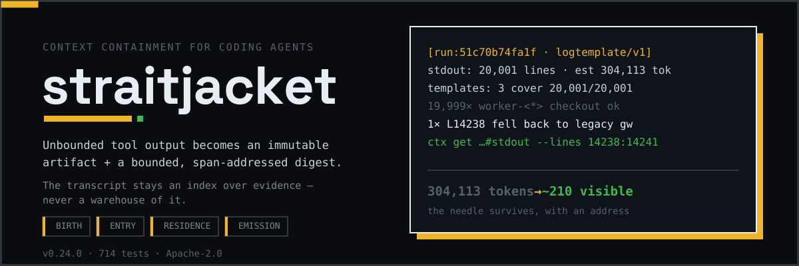
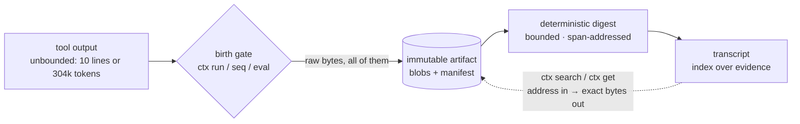
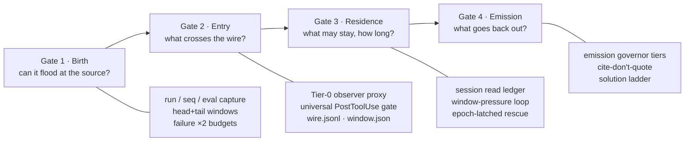
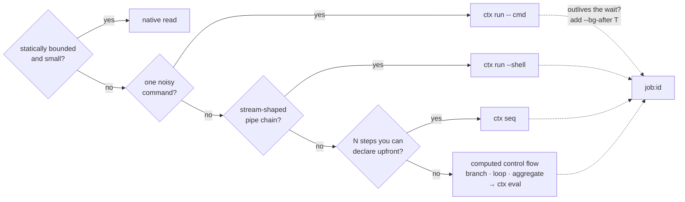
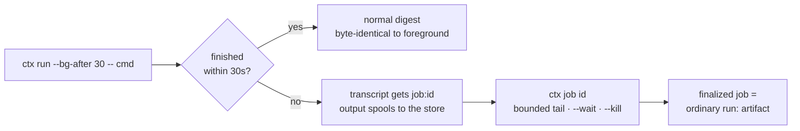
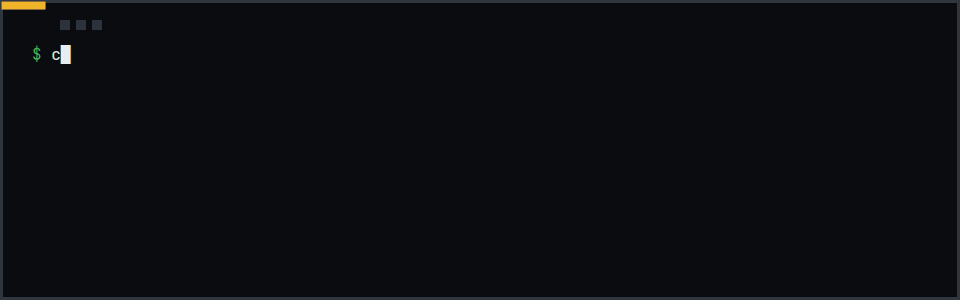
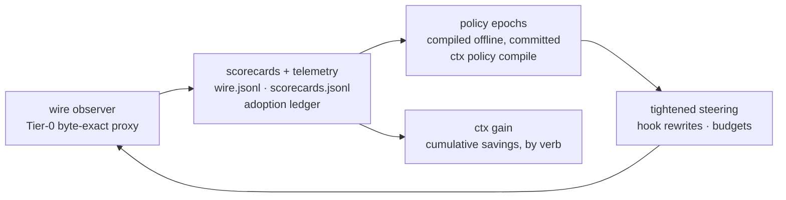

<div align="center">



[Quickstart](#-quickstart) · [The four gates](#-what-you-get-the-four-gates) · [Digest anatomy](#-digest-anatomy) · [Receipts](#-receipts) · [Design docs](docs/README.md) · [Roadmap](ROADMAP.md)

**Status:** v0.24.0 (pre-1.0, minor bump per mechanism wave) · 714 tests · hosts: Claude Code + Antigravity · Apache-2.0

</div>

One `pytest -q` can dump 300k tokens into your agent's transcript. Every
turn after that re-sends them — a routine `mcp__github__list_commits` alone
is ~19.8k tokens, paid again on every round. Then compaction "saves" you by
deleting the one line you needed, with no trace it ever existed.

straitjacket contains the flood at the source: raw bytes become an
immutable artifact, and the transcript gets a bounded, deterministic,
span-addressed digest instead. The transcript stays an **index over
evidence, never a warehouse of it** — and every omission, whether bytes,
transcript blocks, or engineering decisions, keeps an address.

The operating thesis, proven wave by wave in [`evals/`](evals/): **skills
bias, hooks bound, mechanisms measure.** Doctrine nudges the model,
structural hooks enforce budgets it can't forget, and a wire-level observer
measures every session so the next mechanism is built on receipts, not vibes.



*The whole product in one picture: raw bytes stop at the gate, the
transcript carries addresses, and any address resolves back to the exact
bytes — forever.*

## ⚡ Quickstart

```bash
pip install -e .            # runtime (stdlib-only core; extras optional)
ctx init                    # write ctx.toml + .ctxignore
ctx wrap claude --proxy -- -p "fix the failing tests"   # one harnessed session
ctx stats --session         # wire scorecard: rounds, cache classes, effort mix
ctx gain                    # cumulative containment savings, by verb
```

`ctx wrap` is ephemeral (hooks injected via `--settings`, zero residue);
the Antigravity plugin (`ctx antigravity install`) is the persistent form.
Opt-in extras: `--rescue-pct 70` (lossless mid-session rescue),
`[map]`/`[code]`/`[fast]` pip extras, `rg`/`ctags` binaries, and a Rust
post-hook accelerator (`native/ctx-hook-native`, ~3 ms vs Python's ~29 ms
startup floor — parity-tested byte-for-byte, never required).

## 🆕 New in v0.19–0.20

- **Head/tail evidence windows.** CLIs put conclusions at the END of
  output. Large `text/v1` digests now show the first 5 and last 5 lines
  (configurable) with real coordinates; the omitted middle carries a
  deterministic span and a `ctx get --lines` continuation. Built from a
  measured failure: a flood scenario's own SUMMARY line was being omitted.
- **Long-runner backgrounding.** `ctx run --bg-after 30 -- <cmd>`: finish
  within 30s and you get the normal digest, byte-identical to a foreground
  run. Outlive it and the transcript gets `job:<id>` immediately while
  output spools to the store. `ctx job <id>` is a bounded live tail — never
  a flood; finalized jobs are ordinary `run:` artifacts.
- **Programmable capture: `ctx eval`** (the Maki absorption). One Python
  script chains N operations with computed control flow; only its bounded
  digest returns, and the script itself is an addressable `blob:` cited in
  the digest header. Measured: 146 tokens vs 96k naive on a 30-file
  aggregate ([`evals/eval-collapse-2026-07-18.md`](evals/eval-collapse-2026-07-18.md)).
- **Adoption-measured steering.** The hook detects eval opportunities
  (python heredocs, `-c`, ephemeral scripts), teaches the collapse at the
  friction point, and ledgers every opportunity — so adoption is a measured
  ratio per session, not an anecdote.

Full history: [`CHANGELOG.md`](CHANGELOG.md).

## 🔒 The core invariant

> Every potentially unbounded operation MUST either execute inside
> straitjacket, returning a bounded artifact digest, or be flatly rejected
> before execution.

- **Zero token bloat** *(shipped)*: multi-megabyte outputs are captured at
  the source; the transcript indexes repository state and artifacts instead
  of warehousing payload bytes.
- **Absolute determinism** *(shipped)*: timings, temp paths, ANSI noise,
  and locale differences are stripped; identical bytes yield byte-identical
  digests, keeping prompt-cache prefixes stable across sessions.
- **Transparent steering** *(shipped)*: PreToolUse hooks silently rewrite
  flooding commands through `ctx run` — no denial round-trips, no standing
  prompt text.
- **Path containment** *(shipped)*: repo-relative addressing with `..` and
  symlink-escape rejection; `ws:<alias>` roots for multi-workspace sessions.
- **Capability HMAC handles + isolated broker** *(planned, Phase 3)*:
  content-hash handles become unforgeable capabilities once the broker
  daemon owns the store under a separate OS identity.

## 🚪 What you get: the four gates

Every token has four moments in its lifecycle. One artifact store serves
all four as gates; every shipped mechanism hangs off exactly one.



*The taxonomy that organizes everything: prevention at birth, observation
at entry, lifecycle control in residence, discipline at emission.*

| Gate | Question | Mechanisms (all shipped) |
|---|---|---|
| **1 · Birth** | can this output flood at the source? | `ctx run`/`seq`/`eval` capture, supervised backgrounding (`--bg`/`job`), head/tail evidence windows, deterministic digest profiles (lint/pytest/log/search/…), anticipatory inlining, failure-asymmetric budgets |
| **2 · Entry** | what actually crosses the wire? | Tier-0 byte-exact observer proxy (`window.json`, `wire.jsonl`), shape-dispatched PostToolUse gate for every faucet (MCP, WebFetch, Task, …), scorecards |
| **3 · Residence** | what may stay, and for how long? | session read ledger, window-pressure loop, priced steering, epoch-latched lossless rescue, checkpoints |
| **4 · Emission** | what does the model put back? | emission governor tiers, cite-don't-quote, solution ladder + backward planning (each A/B-adopted), deliverable metrics |

Sub-agents inherit all four: the shipped `ctx-explorer` agent reports in
checkpoint shape — conclusion, evidence handles with coordinates, negative
searches included — and a claim without a handle must be labeled a
hypothesis. Fork evidence lands in the shared store; every claim resolves
via `ctx get`.

## 🪜 Choosing a verb: the capture ladder

The most common question, answered as a flowchart:



*Escalate only as far as the work demands; anything that outlives the wait
backgrounds into a `job:` handle instead of idling the session.*

Measured, so you know the ladder is honest
([`evals/eval-collapse-2026-07-18.md`](evals/eval-collapse-2026-07-18.md)):
a bash pipeline under `ctx run --shell` already collapses stream-shaped
chains (266 tok, one round) — `ctx eval`'s round economy is decisive only
where intermediates are *structured*: the 30-file aggregate is 146 tok in
one round vs 96k naive, and the perfect-play bounded-slice baseline
provably cannot finish the task at all. When a script fails mid-corpus,
debug is retrieval, not re-execution: 299 tok to fix and rerun vs 192k to
re-pay the raw chain.

### Long runners



*Never idle on a long process (skill rule 15): background it, keep
working, collect the digest when you need it.*

Six launch/kill/finalize races were identified and closed (single-writer
meta, idempotent finalization, orphan adoption). Job ids, pids, and
timestamps never enter content identity.

## 💾 Digest anatomy

<div align="center">



<sub>The loop in six seconds: flood → gate → digest. (Editable static source: [`containment.svg`](assets/readme/containment.svg))</sub>

</div>

Real output. First, the v0.20 head/tail window on a 4,809-line run with no
error keywords — note the tail carrying the conclusions, and the omitted
middle keeping an address:

```
[ctx run:ba3d1020ee8f profile=text/v1]
command: python3 emit2.py
exit: 0
stdout: 4,809 lines · 126.8 KiB · est 32,452 tokens
summary:
  head stdout:L1: processed item-0001 in 3ms
  head stdout:L2: processed item-0002 in 3ms
  ...
  … omitted stdout:L6-L4804 (4,799 lines) · span f40f9ab8c1
  tail stdout:L4807: p95 latency: 4ms
  tail stdout:L4808: slowest shard: catalog
  tail stdout:L4809: done at rev 8c1f
coverage:
  parsed: 4,809/4,809 lines
  shown: 10 spans · omitted: 4,799 lines
next:
  ctx get run:ba3d1020ee8f#stdout --lines 6:4804
```

Second, `logtemplate/v1` (deterministic Drain-style template mining) on a
20,001-line operational log:

```
[ctx run:51c70b74fa1f profile=logtemplate/v1]
command: python3 emit.py
exit: 0
stdout: 20,001 lines · 1.2 MiB · est 304,113 tokens
templates: 3 cover 20,001/20,001 lines
  19,999× L1: INFO worker-<*> checkout request req-<*> completed in budget
  1× L14238: INFO worker-<*> checkout request req-<*> fell back to legacy gateway after circuit opened
  1× L20001: RUN RESULT: all requests completed
exceptional:
  L14238: INFO worker-13 checkout request req-14237 fell back to legacy gateway after circuit opened
coverage:
  parsed: 20,001/20,001 lines
  shown: 5 spans · omitted: 19,996 lines
next:
  ctx get run:51c70b74fa1f#stdout --lines 14238:14241
```

~304k tokens → ~210 model-visible tokens, and the structurally anomalous
line survives verbatim with an exact retrieval coordinate — because rarity
is structural, not lexical. Profiles ship for text, JSON, JSONL, logs,
pytest, go test, jest/vitest, compilers/linters, search results, and git
diffs. Small outputs skip digesting entirely and return whole (zero-hop
inline, ~20 tokens of scaffold). Failing runs get 2× the digest budget of
successes: **failure is evidence; success is boilerplate.**

Span resolution is structurally bounded: small regions return exact lines,
large regions return a zoom sub-digest minting further sub-spans —
retrieval cannot re-flood the transcript.

## 📐 The measurement loop

Mechanisms measure. Every session generates wire-level ground truth; the
loop turns it into committed policy, and `ctx gain` is your readout.



*Nothing steers on vibes: every branch a mechanism takes emits a receipt,
and receipts compile into the next epoch's policy.*

Concretely:

- `ctx proxy` (Tier-0) relays Anthropic API traffic byte-exact and records
  provider-reported usage, window fullness, and a per-exchange block census
  — no request bodies, no auth headers. Fail-open: no proxy, no harm.
- `ctx stats --session` renders the scorecard: token classes, cache-hit
  breakdown (cold-prefix vs true invalidation vs suffix growth), ttfb vs
  generation, effort mix, deliverable metrics (LOC delta, files touched).
- The **prefix-stability contract** golden-hashes every injected prefix
  byte behind `PREFIX_VERSION` — because a 9-token prompt edit measurably
  cost one full cold cache rewrite per model (~56k tokens).
- A/B adoption is the bar for doctrine: the solution ladder shipped only
  after measuring −28% turns / −33% time / −17% cost; backward planning
  after −17% cost / −16% turns. The `ctx eval` wave's adoption ledger
  exists because the live A/B showed the discipline winning while the verb
  went unadopted — recorded as debt, then instrumented.

## 🧾 Receipts

### The field, in one table

Every system in this space has one good idea held back by a missing layer.
We benchmarked or stress-tested each, absorbed the idea losslessly, and
recorded what each still does better (all receipts in [`evals/`](evals/)).

| Approach | Its one good idea | Held back by (measured where marked) | Absorbed as |
|---|---|---|---|
| Post-hoc compaction / summarization | reclaim a bloated window | rewrites history; evidence irrecoverable, prefix cache invalidated | checkpoint-then-rescue: secure handles first, then clearing is lossless |
| RAG / vector memory | recall without resending | probabilistic, no provenance | deterministic addresses: `run:<id>#stdout --lines 8412:8422` returns the same bytes forever |
| **Headroom** (rewriting wire proxy) | rescue an already-bloated transcript | silent evidence drops (347,595→68 tok, no trace); cache hit 80.6–84.2% vs our 96.5–98.1%; 3–6× cache-write churn | v0.10 epoch-latched lossless rescue: ~18× less cache churn, every elided byte file-backed and addressed |
| **rtk** (bash-hook filter binary) | filter floods at the source | lossy on success paths; no addresses, no cache doctrine | failure-asymmetric budgets, `ctx gain`, structure-not-compression `lint/v1` |
| **Ponytail** (ruleset injection) | the solution ladder | advisory only; never measured whether the ladder held | ladder A/B-adopted on evidence (−28% turns, −33% time, −17% cost) + `ctx debt` |
| **Caveman** (terse prompting style) | say less | destroys evidence to save tokens — the quiet-needle anti-pattern | cite-don't-quote with resolvable handles (skill rules 11–12) |
| **Maki** (sandboxed interpreter) | one script collapses N ops (their demo: 1300×) | no provenance: script and output vanish into the chat log | `ctx eval`: script is an addressable `blob:`, streams span-addressed, tracebacks path-free |

Headroom is the only one we ran head-to-head behind our own observer: on
the quiet structural needle it silently dropped the evidence 100% of the
time (347,595 → 68 tokens, no trace) where `logtemplate/v1` dropped 0%,
and on the long task our mechanisms beat it outright — 42 turns / 243s vs
53 / 279s at comparable cost. The `ctx eval` live A/B ran four pairs: the
one-script discipline won every pair (−15–63% cost, fewer turns), the verb
itself went unadopted in bare sessions — filed as debt; the v0.20 teaching
surface now detects, teaches, and ledgers every opportunity, and conversion
is the next metric to move. Still better than us, on principle not
capability: Headroom's zero-integration generality, rtk's 15-host reach
and <10ms single binary, Ponytail's 20-host rule files, Maki's OS-level
sandbox (ours arrives with the broker, Phase 3).

### Regime scoreboard (worst case and best case, all measured)

| Regime | straitjacket vs naive | vs the field |
|---|---|---|
| Catastrophic floods | 456 tok vs ~222k first exposure (487×) | Headroom silently dropped the needle (347,595→68) |
| Repo comprehension | only-correct-answers across rounds; first-ever haiku pass | untested by others |
| Long overhaul | −21% turns, −9% time, −16% output | beats Headroom on turns/time at par cost |
| Tiny surgical tasks | parity (was 4.5×; graduated engagement fixed it) | rtk-class tasks: parity is the ceiling |
| Mechanical bulk repair | parity after per-file-span iteration | our structurally worst regime, no longer a loss |
| Small spec-driven creation (haiku) | **current loss**: 33 turns (cap) vs naive's 11–26 at 2.7–3.8× cost; quality tied (16/16 holdout all arms), cache hit still best (96–98%) | diagnosed to one loop — pytest digest lacks the failing-test census — fix candidates ranked, referee frozen ([`evals/spec3-haiku-2026-07-18.md`](evals/spec3-haiku-2026-07-18.md)) |

Depth, per topic:
[`evals/matrix-2026-07-18.md`](evals/matrix-2026-07-18.md) (scenario matrix
+ cache economics) ·
[`evals/headroom-needle-drop-2026-07-17.md`](evals/headroom-needle-drop-2026-07-17.md)
(needle-drop head-to-head) ·
[`evals/ab-claude-code-2026-07-17.md`](evals/ab-claude-code-2026-07-17.md)
(N=5 A/B: cost parity, 5/5 correct both arms, zero denials) ·
[`evals/overhaul-3arm-2026-07-17.md`](evals/overhaul-3arm-2026-07-17.md)
(v0.6 rematch: −40% cost vs naive at quality parity) ·
[`evals/rtk-corpus-2026-07-18.md`](evals/rtk-corpus-2026-07-18.md)
(real-corpus reversals + live lint-fix rounds) ·
[`evals/eval-collapse-2026-07-18.md`](evals/eval-collapse-2026-07-18.md)
(programmable capture) ·
[`docs/LOSSLESS-RESCUE.md`](docs/LOSSLESS-RESCUE.md) ·
[`docs/PRICED-CONTEXT.md`](docs/PRICED-CONTEXT.md) ·
[`docs/LADDERS.md`](docs/LADDERS.md) (the conditionality audit behind v0.20).

### The absorptions, in brief

- **rtk** → hypotheses reversed by real corpora before building:
  diagnostics needed *structure, not compression* (`lint/v1` exact
  censuses; the live lint-fix benchmark went honest-loss → iterate →
  parity), and our own scaffold was inflating small outputs (slim inline:
  ~100–400 tok overhead → ~20).
- **Headroom** → its one structural edge (rescuing a bloated transcript)
  taken losslessly: epoch-latched elision, +$0.05 where per-request
  rewriting pays $0.90 in churn, 18 turns of lossless runway per 27k
  elided; live-validated with 10/10 facts correct including elided ones.
- **Ponytail** → solution ladder adopted only after the A/B won on every
  axis; rebuilt with enforcement (`ctx debt`) and per-session measurement.
- **Caveman** → terse narration kept, loss dropped: citations resolve,
  compressed prose doesn't.
- **Maki** → the interpreter collapse generalized (`ctx seq` declared →
  `ctx eval` computed) with the provenance a raw sandbox drops.

## 🏗️ Architecture & deployment

```
skill (doctrine)        plugin (MCP + hooks)
        │                        │
        └──────────┬─────────────┘
                   ▼
        ctx-core harness
        execution scoping · CAS store (SQLite WAL) · deterministic digests
                   │
                   ▼   (Phase 3)
        hardened broker — isolated OS identity, unix socket, encrypted catalog
```

| Mode | Integration | Guarantee | Status |
|---|---|---|---|
| Skill | SKILL.md only | **Advisory**: protocol-trained, bypassable | shipped |
| Plugin | skill + MCP + hooks | **Enforced**: transparent substitution steering on recognized tool paths | shipped |
| Native harness | SDK agent, raw built-ins stripped | **Structural**: raw output cannot physically enter context | planned (Phase 4) |
| Hardened | native + isolated broker | **Isolation-backed**: sandboxed shell cannot read the CAS database | planned (Phase 3) |

### Steering policy (the hooks)

The PreToolUse classifier is conservative and config-driven. Under default
`steering = "auto"` it **rewrites instead of denying**:

- **Untouched**: ctx-routed calls, bounded commands and all-bounded chains,
  small reads, redirections to real files.
- **Silently rewritten**: framework suites, raw `cat`/`find`/`git diff`,
  unbounded package/cloud commands → `ctx run`; oversized reads → bounded
  limit windows; unbounded native `Grep` → capped with a pointer to the
  structured digest. Rewrite reasons carry the price: "~30k tok ≈ 15% of
  window" ([`docs/PRICED-CONTEXT.md`](docs/PRICED-CONTEXT.md)).
- **Forced confirmation, never rewritten**: secret-bearing paths,
  outside-workspace access, interactive programs.

Beyond per-command classification: a cumulative session read ledger puts
native reads under graduated pressure past 256 KiB, and the universal
PostToolUse gate replaces any tool result over 16 KiB — from any faucet,
MCP included — with a digest carrying a working `ctx get` ref, raw bytes
persisted losslessly first. Strict installs set `steering = "deny"`;
fail-open on internal error is the default, fail-closed is one config line.

### Source layout

```
straitjacket/
├── src/ctx/           # cli, hook (stdlib-only hot path), mcp, store (CAS+SQLite),
│                      # execution, refs, retrieval, repomap, rundiff, jobs, pyeval,
│                      # rescue, proxy, wrap, scorecard, digest/ (profiles)
├── native/ctx-hook-native/  # optional Rust post-hook shim (~3 ms), parity-tested
├── plugins/antigravity/     # plugin template: hooks, MCP config, skill, ctx-explorer agent
├── spec/              # normative SPEC, acceptance suite, ADRs, wire schemas
├── docs/              # design docs — EDC, reflex, ladders, priced context, rescue
├── evals/             # every measured claim in this README
├── assets/readme/     # README visuals (self-contained SVG, no remote fetches)
└── tests/             # 361 acceptance-oriented determinism & security tests
```

## 📖 Reference

### Verbs

Full flags and when-to-use detail:
[`plugins/antigravity/skills/ctx-harness/references/verbs.md`](plugins/antigravity/skills/ctx-harness/references/verbs.md).

| Verb | One line |
|---|---|
| `run` / `seq` | birth-gate capture; `seq` runs a declared N-step tree in one round, each step addressable |
| `eval` | programmable capture: a Python script chains N ops with computed control flow in one round; only its digest returns, and the script itself is an addressable `blob:` |
| `run --bg` / `--bg-after T` / `job` / `jobs` | long-runner backgrounding: `job:<id>` in the transcript, bounded live tail, `--wait`, `--kill`; finalized jobs are ordinary `run:` artifacts |
| `search` / `get` / `stats` | batched patterns · exact slices (`--lines/--span/--symbol/--records/--json-pointer/--bytes`) · shape stats, or a priced symbol outline on a single code file |
| `map` / `def` / `refs` / `diag` | ranked priced codebase map · symbol definition/reference/diagnostic verbs |
| `callers` / `callees` / `impact` | call graph: direct callers, callees, transitive blast radius (`--depth ≤6`) — one query replaces a recursive grep trace |
| `diff run:A run:B` | regression delta between captured runs, span-backed |
| `stats --session` / `gain` | wire scorecard (rounds, cache classes, effort mix) · cumulative savings |
| `checkpoint` / `pin` / `gc` | cache epochs · retention leases · mark-and-sweep |
| `debt` | declared-omission ledger for deferred engineering decisions (`add`/`list`/`resolve`) |
| `policy` | compiled steering policy from telemetry (`compile`/`show`) |
| `wrap` / `proxy` / `hook` | session harness · Tier-0 observer (opt-in Tier-1 `--rescue-pct`) · host hook stages |
| `init` / `doctor` | write `ctx.toml` + `.ctxignore` · validate hooks, manifests, store, classifier |

Examples:

```bash
ctx run --focus "find test failures" --cwd services/payments -- pytest -q
ctx run --bg-after 30 -- npm run build          # backgrounds if it outlives 30s
ctx seq 'pytest -q' 'ruff check .' 'npm run build'
ctx eval - <<'EOF'                              # computed control flow, one round
import json, glob, statistics
lat = [json.loads(l)["ms"] for f in glob.glob("runs/*.jsonl") for l in open(f)]
print(f"p95: {statistics.quantiles(lat, n=20)[18]:.0f}ms over {len(lat)} records")
EOF
ctx search repo: 'TimeoutError' 'deadline' --glob '**/*.py' --context 3
ctx get run:7bd91f2a4c3d#stdout --lines 8412:8440
ctx get run:7bd91f2a4c3d#stdout --span e37f99e4a5   # token minted in the digest
ctx get repo:svc/retry.py --symbol Handler.process
ctx stats repo:src/ctx/hook.py     # priced symbol outline: 12.8–54.5× cheaper than the file
ctx map --budget 500 --focus payments
ctx impact register_span --depth 4
ctx diff run:7bd91f2a4c3d run:9ae02c17b5ff
```

### Selector grammar

Absolute host paths never appear in model-visible output. Two address
spaces:

- **Repository selectors** (live workspace state, snapshot-on-read):
  `repo:` · `repo:src/payments/service.py` · `repo:services/payments`
  (subtree) · `ws:api/repo:src/main.py` (multi-workspace) · `--scope
  payments` (named monorepo scopes from committed `ctx.toml`)
- **Immutable artifact handles** (content-addressed, workspace-scoped):
  `run:7bd91f2a4c3d` / `run:…#stdout` / `run:…#stderr` ·
  `snapshot:fe21c91ad4e8` (file state pinned at read time) · `blob:…`
  (raw content, incl. eval scripts) · `checkpoint:…` (frozen task epochs) ·
  `job:…` (backgrounded runs, until finalized into `run:`)

*(Planned, Phase 3: handles upgraded to HMAC capabilities once the
isolated broker owns the store.)*

### MCP surface

One stable tool (**ctx**), operations via parameter states — no dynamic
tool injection, so the prompt-cache prefix never churns:

```json
{
  "name": "ctx",
  "description": "Bounded retrieval against repository state or captured artifacts.",
  "input": {
    "op": "search | get | stats | map | repo | doctor",
    "ref": "run:<id>[#stdout|#stderr] | snapshot:<id> | repo:[path]",
    "patterns": ["TimeoutError", "deadline"],
    "selector": {"lines": "8412:8440"},
    "maxTokens": 1200
  }
}
```

Command execution stays on `ctx run` through the host's native command tool
so the user's permission flow remains visible (SPEC §10.4).

### Configuration

Commit a `ctx.toml` at the workspace root:

```toml
version = 1

[budgets]
digest_tokens = 480
result_tokens = 1200
turn_retrieval_tokens = 2800
max_inline_bytes = 16384
digest_head_lines = 5          # head/tail evidence windows (v0.20)
digest_tail_lines = 5
failure_budget_factor = 2.0    # failure is evidence; success is boilerplate

[guard]
mode = "guarded"               # advisory | guarded | strict
unknown_command = "force_ask"
internal_error = "allow"       # fail-open: a broken guard must not brick the workspace
```

Dependency policy is tiered by path criticality: the hook hot path is
stdlib-only; the runtime carries one pure-Python dep (`pathspec`);
`ripgrep`/`ctags`/`grimp`/`jedi`/`orjson` are opportunistic accelerators
with transparent fallbacks — same output contract, same coordinates, the
active engine disclosed in headers.

```bash
pip install -e .                            # from a clone (not yet on PyPI)
ctx antigravity install --scope workspace --workspace .   # persistent plugin
ctx wrap claude -- -p "fix the failing test"              # or: ephemeral wrap
ctx wrap --print-config claude              # equivalent config for CI/manual setup
ctx doctor --antigravity                    # verify hooks, manifests, store, classifier
```

`ctx wrap claude --proxy` additionally routes the session's Anthropic API
traffic through the localhost-only observer: byte-exact relay (SSE
unbuffered), fail-open tap recording usage and window fullness — no request
bodies, no auth headers. `ANTHROPIC_BASE_URL` is injected only into the
child process; if the proxy fails to start, the session continues
unproxied.

Development:

```bash
pip install -e '.[dev]'
pytest        # 361 tests: determinism, budgets, hook contract, escapes
```

## 📚 Going deeper

[`docs/`](docs/README.md) — the design docs index: mechanism theses
(priced context, lossless rescue) and the current architecture wave (EDC,
reflex, the composition algebra). [`spec/`](spec/) is normative;
[`evals/`](evals/) holds every receipt; [`CHANGELOG.md`](CHANGELOG.md) is
the wave-by-wave history; [`CONTRIBUTING.md`](CONTRIBUTING.md) explains
the house rules for landing a mechanism.

The same docs also build into a browsable site ([`site/`](site/), Astro +
Starlight): `cd site && npm install && npm run dev`, or deploy via the
manual [`docs-site` workflow](.github/workflows/docs-site.yml) once GitHub
Pages is enabled for the repo.

## 🗺️ Roadmap & license

[`ROADMAP.md`](ROADMAP.md) — the house rule is **replace bytes with
addresses**; next up is the broker era (Phase 3: isolated OS identity, HMAC
capability handles, warm LSP servers) and the conditionality audit's ranked
candidates ([`docs/LADDERS.md`](docs/LADDERS.md)): pressure-aware budgets
through a single resolver, hint follow-through telemetry, guard-mode
outcome accounting. Deliberately not planned: lossy pruning without
addresses — deleting bytes you cannot re-address is the failure mode this
project exists to prevent.

Apache-2.0.
