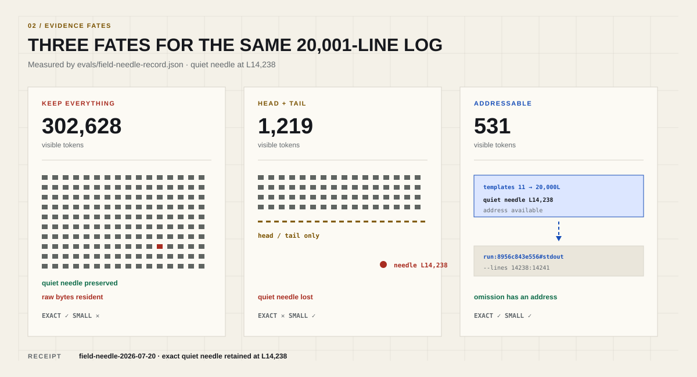
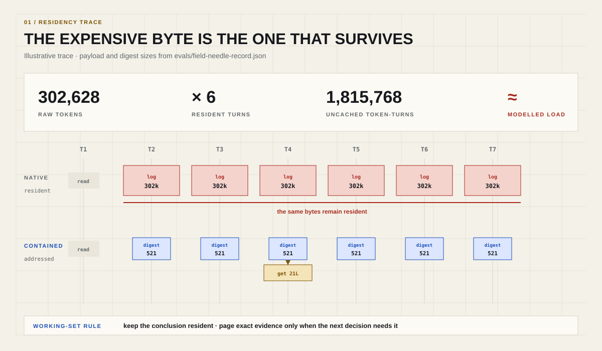
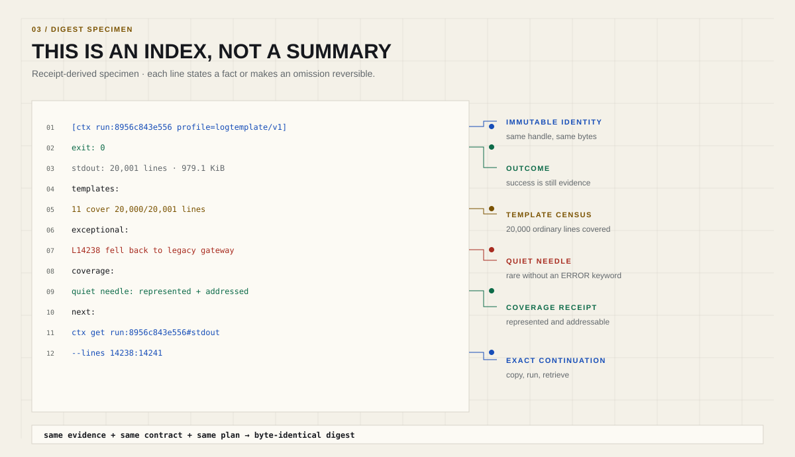
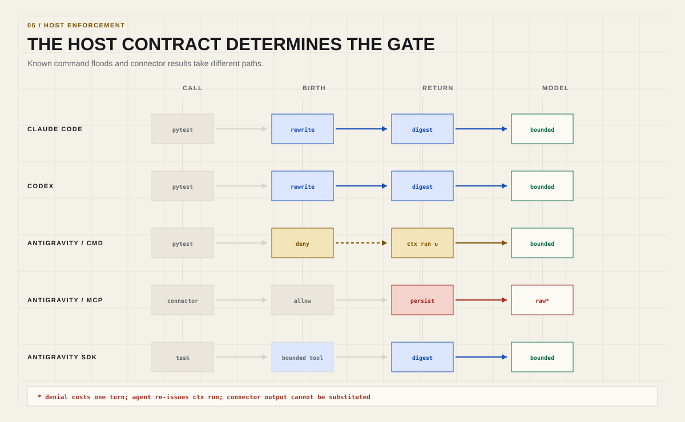
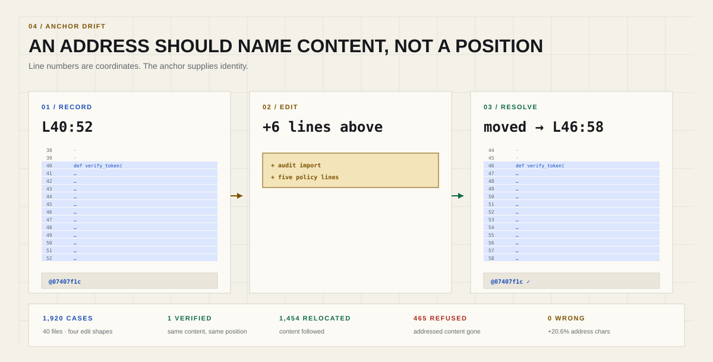

# straitjacket

### Your agent does not need less evidence. It needs less evidence in the prompt.

[](https://github.com/vamsiramakrishnan/straitjacket/actions/workflows/ci.yml)
[](https://pypi.org/project/ctx-harness/)
[](pyproject.toml)
[](LICENSE)

**v0.35.1 · pre-1.0 · Apache-2.0**

One log prints 302,628 tokens. The agent needs one quiet line.

The usual fix is to truncate the log. That saves the window and destroys the evidence. The other fix is to keep the log. That preserves the evidence and makes every later turn carry it.

Both choices are wrong for the same reason: they treat evidence and context as the same thing.

straitjacket separates them.

<picture>
  <source media="(max-width: 640px) and (prefers-color-scheme: dark)" srcset="assets/readme/diagrams/ae-evidence-fates-mobile.svg">
  <source media="(max-width: 640px)" srcset="assets/readme/diagrams/ae-evidence-fates-mobile-light.svg">
  <source media="(prefers-color-scheme: dark)" srcset="assets/readme/diagrams/ae-evidence-fates.svg">
  
</picture>

The complete output stays local. The model sees a small deterministic digest. If it needs one missing region, it retrieves that region—not the entire payload again.

That is context containment.

## Five lines to try it

```bash
python -m pip install --upgrade ctx-harness
cd your-repository
ctx setup
ctx doctor
ctx run -- pytest -q
```

The package is `ctx-harness`. The command is `ctx`. Python 3.11 or newer is required.

## The expensive byte is the one that survives

People tend to price an agent session by what tools produce. The larger cost is what the transcript keeps.

Suppose a tool emits (B) tokens on turn (k), and the task ends on turn (T). Without containment, those bytes can remain in the prompt for every later turn:

```text
resident cost ≈ B × (T - k + 1)
```

A 100,000-token build log produced early in a 20-turn debugging session is not a 100,000-token event. It is up to two million token-turns of residency.

The log is useful once. Its conclusions may be useful for several turns. Its raw bytes are almost never useful on every turn.

Larger context windows do not change this. They raise the ceiling while preserving the bill, latency, cache churn, and eventual compaction problem.

<picture>
  <source media="(max-width: 640px) and (prefers-color-scheme: dark)" srcset="assets/readme/diagrams/ae-residency-mobile.svg">
  <source media="(max-width: 640px)" srcset="assets/readme/diagrams/ae-residency-mobile-light.svg">
  <source media="(prefers-color-scheme: dark)" srcset="assets/readme/diagrams/ae-residency.svg">
  
</picture>

## One run, walked through

```bash
ctx run -- pytest -q
```

straitjacket captures stdout and stderr before they enter model context. A pytest profile extracts the evidence the next decision needs:

```text
[ctx run:8d8335db6848 profile=pytest/v2]
exit: 1
stdout: 4,102 lines · 402.1 KiB · est 98,000 tokens
failures:
  tests/test_auth.py::test_token_expiry  tests/test_auth.py:42
coverage:
  identities: 1/1
  omitted: 4,098 lines
next:
  ctx get run:8d8335db6848#stdout --lines 1280:1300
```

The fields vary by profile. A separate, receipt-derived log specimen makes the contract visible:

<picture>
  <source media="(max-width: 640px) and (prefers-color-scheme: dark)" srcset="assets/readme/diagrams/ae-digest-anatomy-mobile.svg">
  <source media="(max-width: 640px)" srcset="assets/readme/diagrams/ae-digest-anatomy-mobile-light.svg">
  <source media="(prefers-color-scheme: dark)" srcset="assets/readme/diagrams/ae-digest-anatomy.svg">
  
</picture>

This is not a summary pretending to be the evidence. It is an index into the evidence.

Need the traceback:

```bash
ctx get run:8d8335db6848#stdout --lines 1280:1300
```

Need the exception:

```bash
ctx search run:8d8335db6848 "MissingTenantError"
```

Need to know what changed after the fix:

```bash
ctx diff run:<before> run:<after>
```

Each answer stays bounded. Retrieval cannot become the second flood.

## Truncation is cheap because someone else pays

`head -100` looks efficient. It sends the loss to the next turn.

The failure may be on line 8,412. The anomaly may appear once in the middle of a repetitive log. A JSON response may contain 12,000 ordinary records and one object with the field that matters. Position is not relevance.

straitjacket uses typed profiles:

| Output | Evidence kept |
|---|---|
| Tests | failed identities, locations, outcome census |
| Diagnostics | severity, code, file, line |
| Logs | rare templates, repeated families, head and tail |
| JSON / JSONL | shape, counts, exceptional records |
| Search | matches, files, coverage |
| Generic text | bounded windows with addresses for the rest |

Every profile declares what is required, what can contract, and what may remain out of context only when it is retrievable. Every digest carries a coverage receipt.

Short output is not automatically good output. The useful metric is task success at lower context residency.

## The invariant

> Potentially unbounded output must be captured before it reaches the model or rejected before execution.

straitjacket applies that rule at four points:

| Gate | Question |
|---|---|
| Birth | Can this operation flood before it runs? |
| Entry | What crossed the tool or host boundary? |
| Residence | What still deserves space in active context? |
| Emission | Is stored evidence about to be pasted back into the answer? |

Birth is the load-bearing gate. It is cheaper to prevent a flood than to repair a transcript after one.

`ctx setup` installs host-specific enforcement:

<picture>
  <source media="(max-width: 640px) and (prefers-color-scheme: dark)" srcset="assets/readme/diagrams/ae-host-lanes-mobile.svg">
  <source media="(max-width: 640px)" srcset="assets/readme/diagrams/ae-host-lanes-mobile-light.svg">
  <source media="(prefers-color-scheme: dark)" srcset="assets/readme/diagrams/ae-host-lanes.svg">
  
</picture>

Antigravity's published hooks cannot mutate PreToolUse arguments or replace PostToolUse output. The limitation is in the host contract, so the documentation says so. See [Host capabilities](docs/HOST-CAPABILITIES.md).

## Addresses are the product

Compression is easy if losing information is allowed. The hard part is omission without amnesia.

Frozen artifacts use immutable handles:

```text
run:8d8335db6848#stdout
snapshot:fe21c91ad4e8
blob:7bd91f2a4c3d
```

Repository files are harder. An agent edits them. Line 42 today may contain different code on the next turn.

straitjacket can attach a content anchor:

```bash
ctx get repo:src/auth.py --lines 40:52@07407f1c
```

On retrieval, it follows a strict ladder:

1. verify the content at the recorded position;
2. relocate it if the same content moved;
3. refuse if the content no longer exists.

It does not silently return whatever now occupies lines 40–52. A refusal is cheaper than false evidence.

<picture>
  <source media="(max-width: 640px) and (prefers-color-scheme: dark)" srcset="assets/readme/diagrams/ae-anchor-drift-mobile.svg">
  <source media="(max-width: 640px)" srcset="assets/readme/diagrams/ae-anchor-drift-mobile-light.svg">
  <source media="(prefers-color-scheme: dark)" srcset="assets/readme/diagrams/ae-anchor-drift.svg">
  
</picture>

## Use the smallest machine that fits the work

| Work shape | Command |
|---|---|
| One noisy command | `ctx run -- <command>` |
| Pipeline or shell syntax | `ctx run --shell '<pipeline>'` |
| Known sequence | `ctx seq` |
| Computed local control flow | `ctx py <script>` |
| Work that may outlive the turn | `ctx run --bg-after 30 -- <command>` |
| Exact retrieval | `ctx get <handle>` |
| Search stored evidence | `ctx search <handle> <pattern>` |
| Compare executions | `ctx diff run:<before> run:<after>` |
| Map a repository | `ctx map --budget 500` |
| Navigate symbols | `ctx def`, `ctx refs`, `ctx callers` |
| Ask a typed question | `ctx ask '<question>' --intent <intent>` |
| Compile an investigation | `ctx plan run <plan.json>` |
| Inspect session economics | `ctx stats --session` |

The operating rule is precise:

> Batch deterministic fan-out. Return to the model at uncertainty boundaries.

Do not make the model schedule five searches whose order is already known. Do not compile a fifty-step investigation while the first result could invalidate the hypothesis.

## What it is not

straitjacket is not:

- a bigger context window;
- agent memory;
- a free-form summarizer;
- transcript rewriting;
- a process sandbox.

Commands still run with the invoking user's authority. Mutation approvals remain mutation approvals. Context containment does not turn a dangerous command into a safe one.

## Receipts, including the awkward ones

The repository keeps evaluation code, fixtures, positive results, and negative results in [`evals/`](evals/).

Measured surfaces include:

- 8×–151× containment across real output families;
- 302,628 raw tokens reduced to 521 visible tokens with the quiet needle retained;
- 96.5–98.1% prompt-cache hit rates in measured runs;
- equal-correctness agent A/Bs;
- decisive-evidence preservation;
- Python and native-hook latency;
- six investigation rounds collapsed to one;
- content-anchor behaviour across real edits;
- policy candidates rejected when they cost more than the baseline.

The last item matters. A system that only publishes wins becomes a marketing harness. straitjacket uses failed experiments to delete mechanisms, narrow claims, and find the regime where the native path is better.

## Read next

1. [How it works](docs/HOW-IT-WORKS.md) — the complete lifecycle of one byte.
2. [Getting started](docs/GETTING-STARTED.md) — install, setup, capture, retrieval.
3. [Core concepts](docs/CONCEPTS.md) — artifacts, handles, spans, contracts, plans.
4. [CLI guide](docs/CLI.md) — the operational surface.
5. [Architecture](docs/ARCHITECTURE.md) — source ownership and invariants.

Reference:

- [Documentation map](docs/README.md)
- [Configuration](docs/CONFIGURATION.md)
- [Use cases](docs/USE-CASES.md)
- [Troubleshooting](docs/TROUBLESHOOTING.md)
- [Normative specifications](spec/)
- [Evaluation receipts](evals/)
- [Changelog](CHANGELOG.md)
- [Roadmap](ROADMAP.md)

## Development

```bash
git clone https://github.com/vamsiramakrishnan/straitjacket.git
cd straitjacket
python -m pip install -e '.[dev]'
pytest
```

Read [CONTRIBUTING.md](CONTRIBUTING.md) before changing a mechanism. New mechanisms need a clear owner plane, deterministic output, explicit degradation, and a named evaluation gate.

Apache-2.0.
