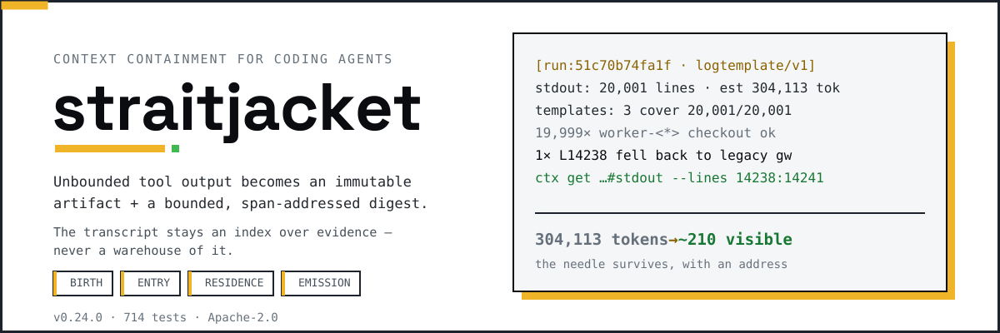
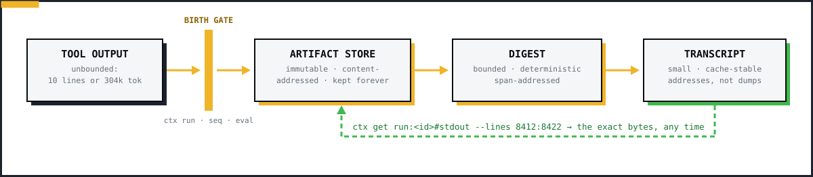
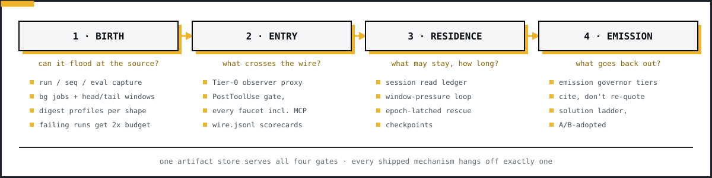
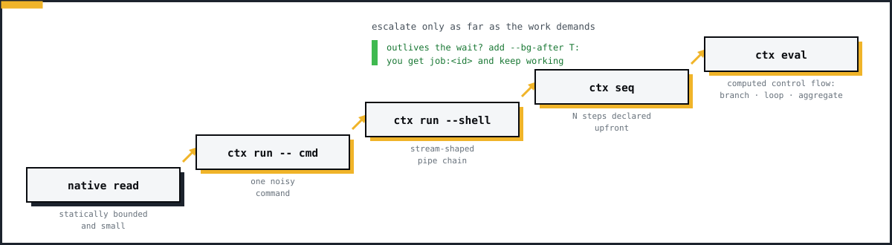
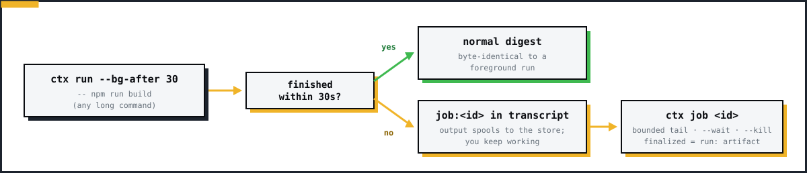
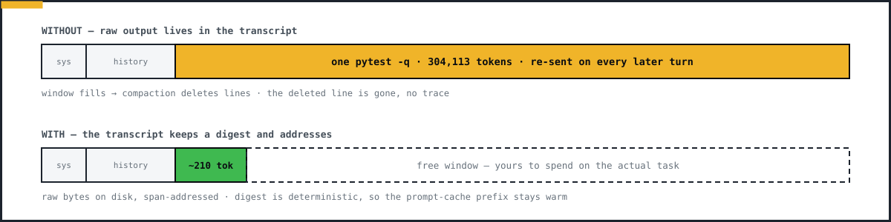
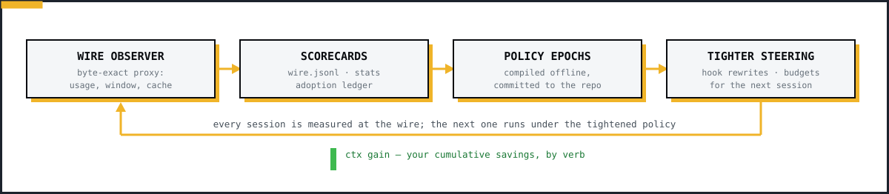
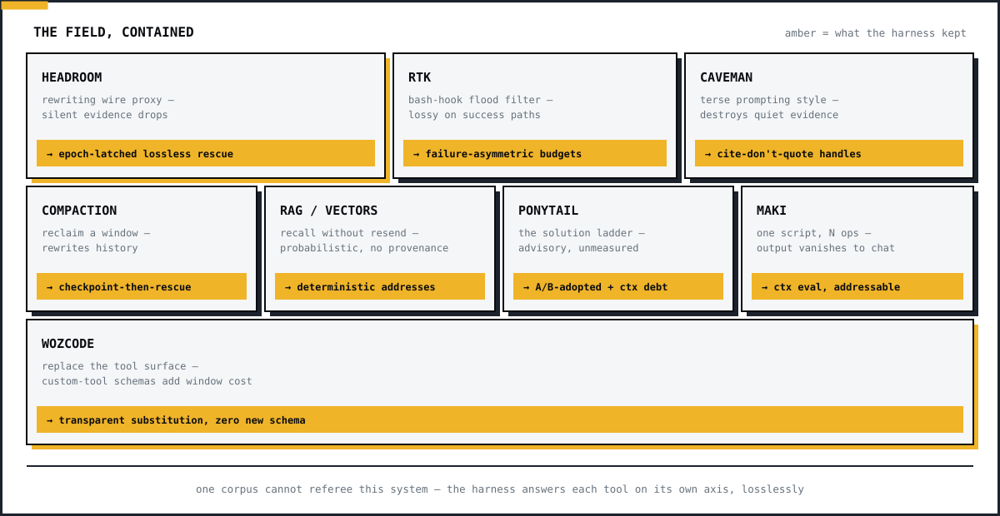
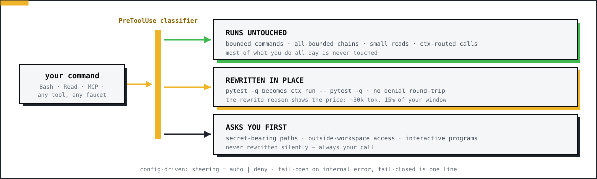

<div align="center">
<picture>
  <source media="(prefers-color-scheme: dark)" srcset="assets/readme/hero.svg">
  
</picture>

[](https://github.com/vamsiramakrishnan/straitjacket/actions/workflows/ci.yml)
[](pyproject.toml)
[](LICENSE)
[](docs/README.md)

[Quickstart](#-quickstart) · [How it works](docs/HOW-IT-WORKS.md) · [The four gates](#-the-four-gates) · [Digest anatomy](#-digest-anatomy) · [Comparisons](#-comparisons) · [Design docs](docs/README.md) · [Roadmap](ROADMAP.md)

**Status:** v0.31.0 (pre-1.0, minor bump per mechanism) · 1,159 tests · **built for Antigravity — works with Claude Code and Codex** · Apache-2.0

</div>

One `pytest -q` can dump 300k tokens into your agent's transcript. Every
turn after that re-sends them, so you pay for those tokens again on every
round — a routine `mcp__github__list_commits` alone is ~19.8k tokens per
round. Then compaction deletes the one line you needed, with no trace it
ever existed.

straitjacket stops that at the source. The raw bytes go into an immutable
local store, and the transcript gets a small, deterministic digest instead.
The digest is a fixed size no matter how much output the command produced.
Every byte it leaves out keeps an address, so you can pull the exact
original bytes back at any later turn.

You run coding agents daily and pay per token per turn. This keeps the
window small, keeps the cost down, and keeps the failing test line
retrievable after compaction would have dropped it.

<div align="center">

<picture>
  <source media="(prefers-color-scheme: dark)" srcset="assets/readme/diagrams/flow.svg">
  
</picture>

</div>

Raw bytes stop at the gate. The transcript carries the digest and its
addresses. Any address resolves back to the exact original bytes later.

> **New here?** The CLI is `ctx`, installed from a clone (no PyPI release yet).
> The gentlest introduction is **[How it works](docs/HOW-IT-WORKS.md)** — one
> command walked through the whole system in plain language, ten minutes. The
> rest of this README is the reference tour; skip to [Quickstart](#-quickstart)
> to just install it.

## ⚡ Quickstart

Three commands, from zero to a harnessed agent:

```bash
pip install -e .    # from a clone (PyPI release pending); Python 3.11+
cd your-repo
ctx wrap setup      # done — Antigravity, Claude Code, and Codex are harnessed
```

`ctx wrap setup` is idempotent and non-destructive: it merges into existing
config, never clobbers it, and re-running is a no-op. From the next agent
session on, flooding tool output is captured into a local store and your
agent sees a small digest with exact retrieval addresses instead.

It also walks you through it rather than dumping paths — four steps, about five
seconds:

1. **What you have** — which agent CLIs were found, which will be harnessed,
   which were skipped and why, and which are optional (never configured behind
   your back).
2. **Harnessing** — every file written, named, so the undo note is true.
3. **Verifying** — re-runs `ctx doctor`'s own checks, so setup and the doctor
   cannot disagree about what "healthy" means.
4. **What now** — the one command to try immediately, and how to see what it
   saved.

If a check fails it says which one, what to do, and exits non-zero — it never
reports success while broken. Scripts that want just the installer report can
set `CTX_SETUP_PLAIN=1`.

**See it work** (no agent needed):

```bash
ctx run -- pytest -q        # run anything noisy through the harness
```

```
[ctx run:8d8335db6848 profile=pytest/v2]
stdout: 4,102 lines · 402.1 KiB · est 98,000 tokens   ← what your agent DIDN'T pay for
failing tests (census):
  1. tests/test_auth.py::test_token_expiry   tests/test_auth.py:42
next:
  ctx get run:8d8335db6848#stdout --lines 1284:1300   ← any omitted byte, on demand
```

Setting up one host only, or checking what setup writes first:

| | |
|---|---|
| `ctx wrap antigravity` / `claude` / `codex` | set up a single host |
| `ctx wrap <host> --print-config` | preview the exact config without writing it |
| `ctx wrap claude -- -p "fix the tests"` | one ephemeral Claude session, zero residue |
| `ctx doctor --antigravity` | verify the install (hooks, store, classifier, plugin) |

Everything else — the wire-observer proxy, mid-session rescue, pip extras,
the optional Rust hook accelerator — is opt-in and documented in
[Getting started](docs/GETTING-STARTED.md). New to the project? Read
**[How it works](docs/HOW-IT-WORKS.md)** first — it walks one command
through the whole system in plain language.

## 🆕 Recent highlights

Plain-language highlights from recent releases; full detail in
[`CHANGELOG.md`](CHANGELOG.md).

- **One-command, three-host setup.** `ctx wrap setup` harnesses Antigravity,
  Claude Code, *and Codex* (with real enforcement, not just advice) in a
  single idempotent command.
- **Harness collaboration by capability × price, per model.** `ctx wrap detect`
  finds every coding-agent CLI on PATH and prices it by its model;
  `ctx orchestrate "<task>"` then has a cheap coordinator (Gemini-flash-lite)
  split the task into a `ctx.route/v1` DAG and route each node to the right
  *(harness, model)*: **planning → the flagship (Opus)**, **implementation →
  complexity-adaptive** (Gemini 3.6 Flash for real work, 3.5 Flash-lite for a
  simple edit), explore/verify → an economy model — even within one harness. A
  **closed loop** runs it: parallel waves, addressed-evidence handoff (not
  bytes), failure escalation to a stronger model, bounded re-planning. The point
  is **allocation, not raw savings**: it spends the flagship (Opus) only on the
  plan step and keeps every other phase cheap — about the cost of running the
  whole task on Sonnet, and far under running it all on Opus. The
  [receipt](evals/orchestrator-cost-routing-2026-07-24.md) shows the honest
  per-baseline math (it is *not* cheaper than a flat Sonnet run). Separately, a
  **live real-task** run had the cheap Gemini node plan and Claude implement with
  its own tools (no API key) until a failing test went green — a cross-vendor
  handoff through the loop, not a cost demo
  ([receipt](evals/live-collab-antigravity-claude-2026-07-24.md)).
- **Compiled investigations.** `ctx plan` / `ctx plan run` let an agent
  run a bounded multi-step evidence program in **one round instead of N**
  — measured 6 rounds → 1 ([receipt](evals/plan-collapse-2026-07-19.md)).
- **The harness now measures itself.** `ctx replay --regret` scores each
  digest profile's distance from the evidence frontier; `ctx replay
  --outcomes` reports whether agents actually *use* each digest's evidence
  — both computed from your own recorded sessions, offline, deterministic
  ([how to read them](docs/THEORY.md)).
- **Proven on a real SWE-bench task.** django__django-13569 solved
  end-to-end — gold-equivalent fix from addressed evidence at ~900 visible
  tokens, ≥20× less than reading the involved files
  ([receipt](evals/swe-django-13569-2026-07-19.md)).
- **First non-Claude numbers.** Antigravity-SDK A/B on `gemini-3.5-flash`:
  −30% billed tokens, 152× less tool output at equal correctness on an
  unavoidable flood — and the regime where naive wins is published too
  ([receipt](evals/antigravity-gemini-2026-07-19.md)).

## 📊 What's measured (and what isn't yet)

Every performance claim in this README links to a reproducible receipt.
The quick map:

| Question | Instrument | Latest receipt |
|---|---|---|
| Does containment survive hostile outputs? | coverage corpus: 11 real output families (cargo, ps, docker, kubectl, mvn, aws, …) | floods collapse 8×–151×; small outputs pass through ~1× — [`evals/coverage-corpus-2026-07-19.md`](evals/coverage-corpus-2026-07-19.md) |
| Does it help a real agent on a real task? | live A/B, same agent both arms | −30% / 152× (Antigravity SDK); parity-to-loss when the flood is cheaply greppable — published |
| Does it ever drop the decisive line? | needle-drop + evidence conformance tests | 0% dropped (vs 100% for a rewriting proxy) |
| Is each digest near-optimal? | `ctx replay --regret` per profile | pytest/v1 frontier 0.17, 199/199 facts preserved |
| Hook latency on the hot path? | hot-path profile | ~29 ms Python / ~3 ms native Rust per intercepted call |

**Honestly not yet measured:** a full Terminal-Bench (or similar)
agent-driving run. The static half exists — the coverage corpus above
referees digest shape against exactly the output families Terminal-Bench
exercises — but the dynamic half (an agent driving those outputs under a
task) is a declared TO-BUILD in the
[benchmark charter](evals/BENCHMARK.md), which also explains why no single
leaderboard can referee a system that changes the agent's information
channel.

## 🔒 The core invariant

> Every potentially unbounded operation MUST either execute inside
> straitjacket, returning a bounded artifact digest, or be flatly rejected
> before execution.

- **Zero token bloat** *(shipped)*: multi-megabyte outputs are captured at
  the source; the transcript indexes repository state and artifacts instead
  of holding the payload bytes.
- **Absolute determinism** *(shipped)*: timings, temp paths, ANSI noise, and
  locale differences are stripped; identical bytes yield byte-identical
  digests, so your prompt-cache prefix stays stable across sessions.
- **Transparent steering** *(shipped)*: PreToolUse hooks rewrite flooding
  commands through `ctx run` in place — no denial round-trips, no standing
  prompt text.
- **Path containment** *(shipped)*: repo-relative addressing that rejects
  `..` and symlink escapes; `ws:<alias>` roots for multi-workspace sessions.
- **Capability HMAC handles + isolated broker** *(planned, Phase 3)*:
  content-hash handles become unforgeable capabilities once the broker daemon
  owns the store under a separate OS identity.

## 🚪 The four gates

A token passes four points in its life. One artifact store handles all four
as gates, and every shipped mechanism attaches to exactly one of them.

<div align="center">

<picture>
  <source media="(prefers-color-scheme: dark)" srcset="assets/readme/diagrams/gates.svg">
  
</picture>

</div>

Birth prevents floods at the source, Entry observes what crosses the wire,
Residence controls what stays and for how long, and Emission governs what the
model writes back.

| Gate | Question | Mechanisms (all shipped) |
|---|---|---|
| **1 · Birth** | can this output flood at the source? | `ctx run`/`seq`/`eval` capture, supervised backgrounding (`--bg`/`job`), head/tail evidence windows, deterministic digest profiles (lint/pytest/log/search/…), anticipatory inlining, failure-asymmetric budgets |
| **2 · Entry** | what actually crosses the wire? | Tier-0 byte-exact observer proxy (`window.json`, `wire.jsonl`), shape-dispatched PostToolUse gate for every faucet (MCP, WebFetch, Task, …), scorecards |
| **3 · Residence** | what may stay, and for how long? | session read ledger, window-pressure loop, priced steering, epoch-latched lossless rescue, checkpoints |
| **4 · Emission** | what does the model put back? | emission governor tiers, cite-don't-quote, solution ladder + backward planning (each A/B-adopted), deliverable metrics |

Sub-agents inherit all four. The shipped `ctx-explorer` agent reports in
checkpoint shape — conclusion, evidence handles with coordinates, negative
searches included — and any claim without a handle is labeled a hypothesis.
Fork evidence lands in the shared store, and every claim resolves via
`ctx get`.

## 🪜 Choosing a verb: the capture ladder

The most common question — which verb do I use — as a flowchart:

<div align="center">

<picture>
  <source media="(prefers-color-scheme: dark)" srcset="assets/readme/diagrams/ladder.svg">
  
</picture>

</div>

Use the lightest verb the work allows. Anything that outlives the wait
backgrounds into a `job:` handle instead of idling the session.

The measured differences
([`evals/eval-collapse-2026-07-18.md`](evals/eval-collapse-2026-07-18.md)):
a bash pipeline under `ctx run --shell` already collapses stream-shaped
chains (266 tok, one round). `ctx py` wins on round count only when the
intermediate results are *structured*: the 30-file aggregate is 146 tok in
one round vs 96k naive, and a bounded-slice baseline cannot finish that task
at all. When a script fails mid-corpus, debugging is retrieval, not
re-execution: 299 tok to fix and rerun vs 192k to re-pay the raw chain.

### Long runners

<div align="center">

<picture>
  <source media="(prefers-color-scheme: dark)" srcset="assets/readme/diagrams/longrun.svg">
   while output spools to the store. ctx job gives a bounded tail; finalized jobs become ordinary run: artifacts.">
</picture>

</div>

Don't idle on a long process (skill rule 15): background it, keep working,
collect the digest when you need it.

Six launch/kill/finalize races were identified and closed (single-writer
meta, idempotent finalization, orphan adoption). Job ids, pids, and
timestamps never enter content identity.

## 💾 Digest anatomy

<div align="center">

<picture>
  <source media="(prefers-color-scheme: dark)" srcset="assets/readme/containment.gif">
  
</picture>

<sub>The loop in six seconds: flood → gate → digest. (Editable static source: [`containment.svg`](assets/readme/containment.svg))</sub>

</div>

This is what one turn looks like with and without the harness:

<div align="center">

<picture>
  <source media="(prefers-color-scheme: dark)" srcset="assets/readme/diagrams/econ.svg">
  
</picture>

</div>

Real output. First, the v0.20 head/tail window on a 4,809-line run with no
error keywords — the tail carries the conclusions, and the omitted middle
keeps an address:

```
[ctx run:ba3d1020ee8f profile=text/v1]
command: python3 emit2.py
exit: 0
stdout: 4,809 lines · 126.8 KiB · est 32,452 tokens
summary:
  head stdout:L1: processed item-0001 in 3ms
  head stdout:L2: processed item-0002 in 3ms
  ...
  … omitted stdout:L6-L4804 (4,799 lines) · span f40f9ab8c1
  tail stdout:L4807: p95 latency: 4ms
  tail stdout:L4808: slowest shard: catalog
  tail stdout:L4809: done at rev 8c1f
coverage:
  parsed: 4,809/4,809 lines
  shown: 10 spans · omitted: 4,799 lines
next:
  ctx get run:ba3d1020ee8f#stdout --lines 6:4804
```

Second, `logtemplate/v1` (deterministic Drain-style template mining) on a
20,001-line operational log:

```
[ctx run:51c70b74fa1f profile=logtemplate/v1]
command: python3 emit.py
exit: 0
stdout: 20,001 lines · 1.2 MiB · est 304,113 tokens
templates: 3 cover 20,001/20,001 lines
  19,999× L1: INFO worker-<*> checkout request req-<*> completed in budget
  1× L14238: INFO worker-<*> checkout request req-<*> fell back to legacy gateway after circuit opened
  1× L20001: RUN RESULT: all requests completed
exceptional:
  L14238: INFO worker-13 checkout request req-14237 fell back to legacy gateway after circuit opened
coverage:
  parsed: 20,001/20,001 lines
  shown: 5 spans · omitted: 19,996 lines
next:
  ctx get run:51c70b74fa1f#stdout --lines 14238:14241
```

~304k tokens become ~210 model-visible tokens, and the one anomalous line
survives verbatim with an exact retrieval coordinate, because it is selected
by structure, not by keyword. Profiles ship for text, JSON, JSONL, logs,
pytest, go test, jest/vitest, compilers/linters, search results, and git
diffs. Small outputs skip digesting and return whole (zero-hop inline, ~20
tokens of scaffold). Failing runs get 2× the digest budget of successes,
because a failure carries the evidence you need and a success rarely does.

Span resolution is bounded too: small regions return exact lines, large
regions return a zoom sub-digest that mints further sub-spans. Retrieval
cannot re-flood the transcript.

## 📐 The measurement loop

Every session produces wire-level ground truth about what it cost. The loop
turns that into committed steering policy, and `ctx gain` is your readout of
what it saved.

<div align="center">

<picture>
  <source media="(prefers-color-scheme: dark)" srcset="assets/readme/diagrams/loop.svg">
  
</picture>

</div>

Every branch a mechanism takes records what it did; those records compile
into the next epoch's policy.

Concretely:

- `ctx proxy` (Tier-0) relays Anthropic API traffic byte-exact and records
  provider-reported usage, window fullness, and a per-exchange block census —
  no request bodies, no auth headers. Fail-open: no proxy, no harm.
- `ctx stats --session` renders the scorecard: token classes, cache-hit
  breakdown (cold-prefix vs true invalidation vs suffix growth), ttfb vs
  generation, effort mix, deliverable metrics (LOC delta, files touched).
- The **prefix-stability contract** golden-hashes every injected prefix byte
  behind `PREFIX_VERSION`, because a 9-token prompt edit measurably cost one
  full cold cache rewrite per model (~56k tokens).
- A measured A/B is the bar for shipping a steering change: the solution
  ladder shipped only after −28% turns / −33% time / −17% cost; backward
  planning after −17% cost / −16% turns. The `ctx py` adoption ledger
  exists because a live A/B showed the discipline winning while the verb went
  unadopted — recorded as debt, then instrumented.

## 🧾 Comparisons

Other tools in this space each do one thing well. We benchmarked or
stress-tested each, took the good idea without its cost, and recorded what
each still does better (all data in [`evals/`](evals/)). The amber strip on
each tile below is the idea the harness kept — losslessly.

<div align="center">

<picture>
  <source media="(prefers-color-scheme: dark)" srcset="assets/readme/diagrams/field-treemap.svg">
  
</picture>

</div>

### The field, in one table

| Approach | What it does well | Limitation (measured where marked) | How we took it |
|---|---|---|---|
| Post-hoc compaction / summarization | reclaim a bloated window | rewrites history; evidence irrecoverable, prefix cache invalidated | checkpoint-then-rescue: secure handles first, then clearing is lossless |
| RAG / vector memory | recall without resending | probabilistic, no provenance | deterministic addresses: `run:<id>#stdout --lines 8412:8422` returns the same bytes forever |
| **Headroom** (rewriting wire proxy) | rescue an already-bloated transcript | silent evidence drops (347,595→68 tok, no trace); cache hit 80.6–84.2% vs our 96.5–98.1%; 3–6× cache-write churn | v0.10 epoch-latched lossless rescue: ~18× less cache churn, every elided byte file-backed and addressed |
| **rtk** (bash-hook filter binary) | filter floods at the source | lossy on success paths; no addresses, no cache-stability policy | failure-asymmetric budgets, `ctx gain`, structure-not-compression `lint/v1` |
| **Ponytail** (ruleset injection) | the solution ladder | advisory only; never measured whether the ladder held | ladder A/B-adopted on evidence (−28% turns, −33% time, −17% cost) + `ctx debt` |
| **Caveman** (terse prompting style) | say less | destroys evidence to save tokens — the quiet-needle anti-pattern | cite-don't-quote with resolvable handles (skill rules 11–12) |
| **Maki** (sandboxed interpreter) | one script collapses N ops (their demo: 1300×) | no provenance: script and output vanish into the chat log | `ctx py`: script is an addressable `blob:`, streams span-addressed, tracebacks path-free |

What each still does better than us, by design: Headroom's zero-integration
generality, rtk's 15-host reach and <10ms single binary, Ponytail's 20-host
rule files, Maki's OS-level sandbox (ours arrives with the broker, Phase 3).

**Full detail lives in [`docs/COMPARISONS.md`](docs/COMPARISONS.md):** how each
neighbour is architected and where the harness diverges, the model-free
head-to-head against Headroom, the worst-case/best-case regime scoreboard, and
the measured receipt behind every number above.

## 🏗️ Architecture & deployment

```
skill (protocol)        plugin (MCP + hooks)
        │                        │
        └──────────┬─────────────┘
                   ▼
        ctx-core harness
        execution scoping · CAS store (SQLite WAL) · deterministic digests
                   │
                   ▼   (Phase 3)
        hardened broker — isolated OS identity, unix socket, encrypted catalog
```

| Mode | Integration | Guarantee | Status |
|---|---|---|---|
| Skill | SKILL.md / AGENTS.md only | **Advisory**: protocol-trained, bypassable | shipped |
| Plugin | skill + MCP + hooks | **Enforced**: transparent substitution steering on recognized tool paths | shipped |
| Native harness | SDK agent, raw built-ins stripped | **Structural**: raw output cannot physically enter context | planned (Phase 4) |
| Hardened | native + isolated broker | **Isolation-backed**: sandboxed shell cannot read the CAS database | planned (Phase 3) |

The **Plugin** (enforced) mode is delivered across all three hosts by the same
canonical hook decision, translated to each host's dialect: Antigravity's plugin
`hooks.json`, Claude Code's `.claude/settings.json`, and Codex's `.codex/hooks.json`
(`hookSpecificOutput` PreToolUse + `decision:block` PostToolUse substitution).
One classifier, three emitters — `ctx wrap setup` wires all three at once.

The **birth-gate** decision (PreToolUse: contain flooding commands, steer native
and semantic search to bounded `ctx` ops) fires on all three, but it is applied
differently. Claude Code (`updatedInput`) and Codex rewrite the command
*transparently* — the agent never sees a refusal. Antigravity's [published
PreToolUse schema](https://antigravity.google/docs/hooks) carries no field for
modified arguments, so there the same decision lands as a **deny whose reason
names the contained command**: the flood is still prevented, but the agent
spends a turn re-issuing it itself.

The **output-side** gate (PostToolUse: replace an oversized tool result with a
digest) needs a host field that can substitute output — Claude Code
(`updatedToolOutput`) and Codex (`decision:block`) have one. Antigravity's
published PostToolUse contract permits exactly one output, `{}`: it can neither
replace a result nor attach a nudge, so on that host the PostToolUse hook is
**observational** — it still captures the bytes into the store so `ctx get` can
resolve them later, but it cannot shrink what already reached the transcript. A
verbose MCP/connector result therefore lands in full on Antigravity; retrieve
through the bounded `ctx` MCP tool to stay capped.

### Steering policy (the hooks)

The PreToolUse classifier is conservative and config-driven. Here is what
happens to a command you type:

<div align="center">

<picture>
  <source media="(prefers-color-scheme: dark)" srcset="assets/readme/diagrams/lanes.svg">
  
</picture>

</div>

Under default `steering = "auto"` it **rewrites instead of denying**:

- **Untouched**: ctx-routed calls, bounded commands and all-bounded chains,
  small reads, redirections to real files.
- **Silently rewritten**: framework suites, raw `cat`/`find`/`git diff`,
  unbounded package/cloud commands → `ctx run`; oversized reads → bounded
  limit windows; unbounded native `Grep` → capped with a pointer to the
  structured digest. Each rewrite reason carries the price: "~30k tok ≈ 15% of
  window" ([`docs/PRICED-CONTEXT.md`](docs/PRICED-CONTEXT.md)).
- **Forced confirmation, never rewritten**: secret-bearing paths,
  outside-workspace access, interactive programs.

Beyond per-command classification: a cumulative session read ledger puts
native reads under graduated pressure past 256 KiB, and the universal
PostToolUse gate replaces any tool result over 16 KiB — from any faucet, MCP
included — with a digest carrying a working `ctx get` ref, raw bytes
persisted losslessly first. Strict installs set `steering = "deny"`;
fail-open on internal error is the default, fail-closed is one config line.

### Source layout

```
straitjacket/
├── src/ctx/           # cli, hook (stdlib-only hot path), mcp, store (CAS+SQLite),
│                      # execution, refs, retrieval, repomap, rundiff, jobs, pyeval,
│                      # rescue, proxy, wrap, hosts (registry), orchestrator,
│                      # pricing, scorecard, digest/ (profiles)
├── native/ctx-hook-native/  # optional Rust post-hook shim (~3 ms), parity-tested
├── plugins/antigravity/     # plugin template: hooks, MCP config, skill, ctx-explorer agent
├── plugins/codex/           # Codex template: config.toml (MCP+hooks), hooks.json, AGENTS.md
├── spec/              # normative SPEC, acceptance suite, ADRs, wire schemas
├── docs/              # design docs — EDC, reflex, ladders, priced context, rescue
├── evals/             # every measured claim in this README
├── assets/readme/     # README visuals (self-contained SVG, no remote fetches)
└── tests/             # 1,074 acceptance-oriented determinism & security tests
```

## 📖 Reference

### Verbs

Full flags and when-to-use detail:
[`plugins/antigravity/skills/ctx-harness/references/verbs.md`](plugins/antigravity/skills/ctx-harness/references/verbs.md).

| Verb | One line |
|---|---|
| `run` / `seq` | birth-gate capture; `seq` runs a declared N-step tree in one round, each step addressable |
| `eval` | programmable capture: a Python script chains N ops with computed control flow in one round; only its digest returns, and the script itself is an addressable `blob:` |
| `run --bg` / `--bg-after T` / `job` / `jobs` | long-runner backgrounding: `job:<id>` in the transcript, bounded live tail, `--wait`, `--kill`; finalized jobs are ordinary `run:` artifacts |
| `search` / `get` / `stats` | batched patterns · exact slices (`--lines/--span/--symbol/--records/--json-pointer/--bytes`) · shape stats, or a priced symbol outline on a single code file |
| `map` / `def` / `refs` / `diag` | ranked priced codebase map · symbol definition/reference/diagnostic verbs |
| `callers` / `callees` / `impact` | call graph: direct callers, callees, transitive blast radius (`--depth ≤6`) — one query replaces a recursive grep trace |
| `q` | total, bounded composition over typed evidence: `fails last \| in-changed`, `refs Foo \| group file \| top 5` — no loops, statically priced, every stage addressable |
| `ask` | a repository question through a typed intent (`locate`, `impact`, `diagnose`, `trace`, `compare`, `verify`, `review`) → one investigation digest |
| `plan` / `investigate` | compiled evidence plans ([`docs/EVIDENCE-PLANS.md`](docs/EVIDENCE-PLANS.md)): `validate`/`price` a `ctx.plan/v1` DAG statically, `run` it locally (joins, tests, structural/semantic scans), get ONE ranked investigation digest — O(hypothesis epochs) model rounds instead of O(operations) |
| `diff run:A run:B` | regression delta between captured runs, span-backed |
| `stats --session` / `gain` | wire scorecard (rounds, cache classes, effort mix) · cumulative savings |
| `checkpoint` / `pin` / `gc` | cache epochs · retention leases · mark-and-sweep |
| `debt` | declared-omission ledger for deferred engineering decisions (`add`/`list`/`resolve`) |
| `policy` | compiled steering policy from telemetry (`compile`/`show`) |
| `wrap` / `proxy` / `hook` | session harness · Tier-0 observer (opt-in Tier-1 `--rescue-pct`) · host hook stages; `wrap detect` lists installed CLIs priced by model, `wrap setup` harnesses the ones it finds |
| `orchestrate` | harness collaboration: a cheap coordinator (Gemini-flash-lite) splits a task into a `ctx.route/v1` DAG and routes each node to the cheapest **(harness, model)** that clears its tier — implement on a cheap standard model, plan on a frontier one — then a closed loop runs it: parallel waves, `checkpoint:` handoff (evidence, not bytes), failure escalation to a stronger model, bounded re-planning; prices the plan, then runs it |
| `init` / `doctor` | write `ctx.toml` + `.ctxignore` · validate hooks, manifests, store, classifier |

Examples:

```bash
ctx run --focus "find test failures" --cwd services/payments -- pytest -q
ctx run --bg-after 30 -- npm run build          # backgrounds if it outlives 30s
ctx seq 'pytest -q' 'ruff check .' 'npm run build'
ctx py - <<'EOF'                              # computed control flow, one round
import json, glob, statistics
lat = [json.loads(l)["ms"] for f in glob.glob("runs/*.jsonl") for l in open(f)]
print(f"p95: {statistics.quantiles(lat, n=20)[18]:.0f}ms over {len(lat)} records")
EOF
ctx search repo: 'TimeoutError' 'deadline' --glob '**/*.py' --context 3
ctx get run:7bd91f2a4c3d#stdout --lines 8412:8440
ctx get run:7bd91f2a4c3d#stdout --span e37f99e4a5   # token minted in the digest
ctx get repo:svc/retry.py --symbol Handler.process
ctx stats repo:src/ctx/hook.py     # priced symbol outline: 12.8–54.5× cheaper than the file
ctx map --budget 500 --focus payments
ctx impact register_span --depth 4
ctx diff run:7bd91f2a4c3d run:9ae02c17b5ff
```

### Selector grammar

Every address has the same shape, and the same address returns the same
bytes on any later day:

<div align="center">

<picture>
  <source media="(prefers-color-scheme: dark)" srcset="assets/readme/diagrams/address.svg">
  
</picture>

</div>

Absolute host paths never appear in model-visible output. Two address spaces:

- **Repository selectors** (live workspace state, snapshot-on-read): `repo:` ·
  `repo:src/payments/service.py` · `repo:services/payments` (subtree) ·
  `ws:api/repo:src/main.py` (multi-workspace) · `--scope payments` (named
  monorepo scopes from committed `ctx.toml`)
- **Immutable artifact handles** (content-addressed, workspace-scoped):
  `run:7bd91f2a4c3d` / `run:…#stdout` / `run:…#stderr` ·
  `snapshot:fe21c91ad4e8` (file state pinned at read time) · `blob:…` (raw
  content, incl. eval scripts) · `checkpoint:…` (frozen task epochs) · `job:…`
  (backgrounded runs, until finalized into `run:`)

*(Planned, Phase 3: handles upgraded to HMAC capabilities once the isolated
broker owns the store.)*

### MCP surface

One stable tool (**ctx**), operations selected by parameter — no dynamic tool
injection, so the prompt-cache prefix never churns:

```json
{
  "name": "ctx",
  "description": "Bounded retrieval against repository state or captured artifacts.",
  "input": {
    "op": "search | get | stats | map | def | refs | diag | callers | callees | impact | diff | investigate | repo | doctor",
    "ref": "run:<id>[#stdout|#stderr] | snapshot:<id> | repo:[path]",
    "patterns": ["TimeoutError", "deadline"],
    "selector": {"lines": "8412:8440"},
    "maxTokens": 1200
  }
}
```

Command execution stays on `ctx run` through the host's native command tool
so your permission flow stays visible (SPEC §10.4).

### Configuration

Commit a `ctx.toml` at the workspace root:

```toml
version = 1

[budgets]
digest_tokens = 480
result_tokens = 1200
turn_retrieval_tokens = 2800
max_inline_bytes = 16384
digest_head_lines = 5          # head/tail evidence windows (v0.20)
digest_tail_lines = 5
failure_budget_factor = 2.0    # failing runs get 2x the digest budget of successes

[guard]
mode = "guarded"               # advisory | guarded | strict
unknown_command = "force_ask"
internal_error = "allow"       # fail-open: a broken guard must not brick the workspace
```

Dependency policy is tiered by path criticality: the hook hot path is
stdlib-only; the runtime carries one pure-Python dep (`pathspec`);
`ripgrep`/`ctags`/`grimp`/`jedi`/`orjson` are opportunistic accelerators with
transparent fallbacks — same output contract, same coordinates, the active
engine disclosed in headers.

```bash
pip install -e .                            # from a clone (not yet on PyPI)
ctx wrap setup                              # harness Antigravity + Claude Code + Codex
# ...or one host at a time:
ctx wrap antigravity                        # persistent workspace plugin
ctx wrap codex                              # .codex/ MCP + hooks + AGENTS.md
ctx wrap claude -- -p "fix the failing test"              # ephemeral, zero-residue run
ctx wrap codex --print-config               # preview a host's exact config for CI
ctx doctor --antigravity                    # verify hooks, manifests, store, classifier
```

`ctx wrap claude --proxy` also routes the session's Anthropic API traffic
through the localhost-only observer: byte-exact relay (SSE unbuffered),
fail-open tap recording usage and window fullness — no request bodies, no auth
headers. `ANTHROPIC_BASE_URL` is injected only into the child process; if the
proxy fails to start, the session continues unproxied.

Development:

```bash
pip install -e '.[dev]'
pytest        # 1,074 tests: determinism, budgets, hook contract, escapes
```

## 📚 Going deeper

[`docs/`](docs/README.md) — the design docs index: mechanism notes (priced
context, lossless rescue) and the current architecture work (EDC, reflex, the
composition algebra). [`spec/`](spec/) is normative; [`evals/`](evals/) holds
the measured data; [`CHANGELOG.md`](CHANGELOG.md) is the release history;
[`CONTRIBUTING.md`](CONTRIBUTING.md) explains the house rules for landing a
mechanism.

The same docs also build into a browsable site ([`site/`](site/), Astro +
Starlight): `cd site && npm install && npm run dev`, or deploy via the manual
[`docs-site` workflow](.github/workflows/docs-site.yml) once GitHub Pages is
enabled for the repo.

## 🗺️ Roadmap & license

[`ROADMAP.md`](ROADMAP.md) tracks what is next; the standing rule is to replace bytes with addresses. Next up is the broker era (Phase 3: isolated OS identity, HMAC
capability handles, warm LSP servers) and the conditionality audit's ranked
candidates ([`docs/LADDERS.md`](docs/LADDERS.md)): pressure-aware budgets
through a single resolver, hint follow-through telemetry, guard-mode outcome
accounting. Deliberately not planned: lossy pruning without addresses —
deleting bytes you cannot re-address is the failure mode this project exists
to prevent.

Apache-2.0.
