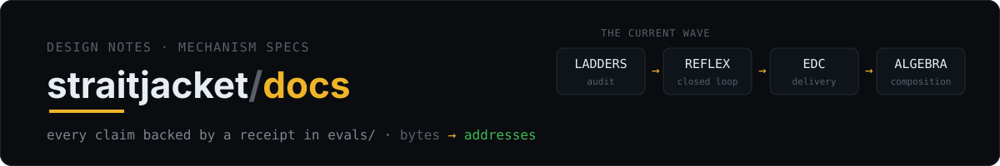
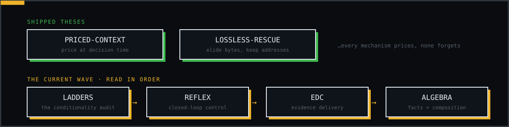

Design notes for straitjacket's mechanisms. The house rules hold here too:
every claim traces to measured data in [`evals/`](../evals/), normative
behavior lives in [`spec/`](../spec/), and shipped history lives in
[`CHANGELOG.md`](../CHANGELOG.md). A design doc is where a mechanism gets its
shape decided *before* it ships: the hypothesis is stated, tested, and kept or
reversed on the evidence.

## Shipped mechanisms

The reasoning behind mechanisms already in the product. Each one shipped only
after a measured A/B or head-to-head.

| Doc | One line |
|---|---|
| [PRICED-CONTEXT.md](PRICED-CONTEXT.md) | Why every retrieval choice carries a visible price — in tokens, at the moment you decide, against the remaining window, with a cheaper alternative attached. |
| [LOSSLESS-RESCUE.md](LOSSLESS-RESCUE.md) | Rescuing an already-bloated transcript the way the rewriting proxy does, without its costs: epoch-latched elision, every elided byte file-backed and addressed. |

## Current architecture work

Written against the spec3 result
([`evals/spec3-haiku-2026-07-18.md`](../evals/spec3-haiku-2026-07-18.md)) —
the one regime straitjacket currently loses. Read in order; each doc builds on
the previous one's diagnosis.

| # | Doc | One line |
|---|---|---|
| 1 | [LADDERS.md](LADDERS.md) | The conditionality audit: every tiered/conditional construct in the product, judged by one rule — a conditional is only as good as its measurement. |
| 2 | [REFLEX.md](REFLEX.md) | Closed-loop conditionality: why open-loop ladders fired on the wrong axis, and the ten reflex design rules for steering on observed session behavior instead. |
| 3 | [EDC.md](EDC.md) | The Evidence Delivery Controller — target architecture for the digest layer: typed Facts per command family, Evidence Contracts, deterministic Delivery Plans; coverage becomes the objective, size the constraint. |
| 4 | [ALGEBRA.md](ALGEBRA.md) | Facts and the composition algebra: the EDC governs how evidence is delivered; this layer governs how it is derived and composed (tree-sitter skeleton tier, derived artifacts, Angle-inspired queries). |

---

<a href="../README.md">« back to straitjacket</a> · <a href="../spec/">spec/</a> · <a href="../evals/">evals/</a> · <a href="../ROADMAP.md">roadmap</a>

