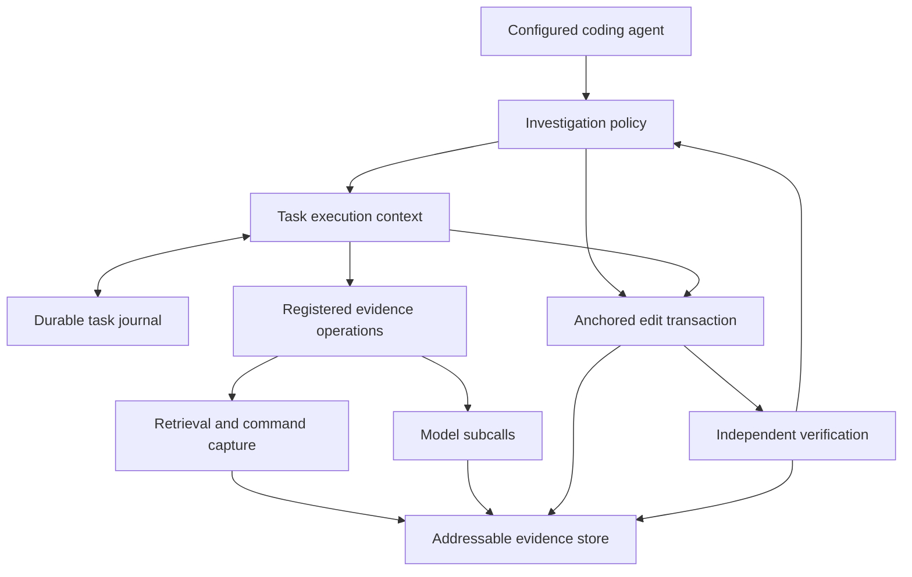

# ADR 007: Durable execution beneath investigation policies

Status: implemented on the semantic-evidence development branch.

## Problem

External-context model analysis was a standalone map. Connecting it to a repair
loop could create a second search implementation, budget, checkpoint format and
patch path. That would make the controller another harness and leave the
underlying Straitjacket commands unable to reuse its guarantees.

Existing task claims/handbacks support orchestration history, but some writes
are best-effort and unknown work may be rerun. Those semantics are insufficient
for a promised root reservation or uncertain edit recovery.

## Decision

Introduce `TaskRuntime` as an explicit, reusable execution mode. Extend the
existing task ledger with versioned operation and checkpoint rows. Require
durable reservation before dispatch and durable outcome afterward. Use one
root allowance for parent decisions, model subcalls, command probes, edits and
verification. Child namespaces share their parent's runtime.

Extend the ordinary plan-operator registry for scoped evidence reads, discovery,
search, semantic maps and named probes. Add a shared dispatcher used by both
compiled plans and adaptive policies. Composite operators charge their leaf
operations rather than creating another root budget.

Keep source capture, edit transactions and verification in their existing
modules. The optional investigation policy chooses operations and transitions;
it does not implement accounting, journaling, search, process execution or CAS.

The registered operator boundary carries capabilities. Model and command
operations require an explicit runtime and remain unavailable to the ordinary
observation-only MCP plan surface. Verification commands are caller-owned and
fixed before the agent reasons about the task.

## Invariants

1. A child cannot silently acquire a fresh task allowance.
2. Persistence failure prevents a new billable or mutating dispatch.
3. Completed results replay by operation and input identity.
4. Unknown model attempts retain reservations and require explicit retry.
5. Unknown mutations require byte reconciliation, not automatic repetition.
6. A model-generated success claim cannot satisfy verification.
7. Source observations, semantic inferences and verification proofs remain
   different artifacts with different meanings.
8. No new model call is introduced into ordinary retrieval implicitly.
9. Static prompt material precedes changing evidence; full observations remain
   outside the parent conversation and retrievable by handle.

## Consequences

The same runtime is directly usable from SDK code, compiled evidence plans and
semantic maps. A test composes a normal plan and a semantic map under one runtime
without importing the controller. This is the acceptance condition for the
feature being shared infrastructure rather than private controller machinery.

The first policy is sequential, uses a retained detached worktree, and proposes
anchored replacements in existing text files. It requires a reproducible
behavioral failure and caller-selected checks. Broader mutation capabilities,
parallel task execution, richer policy operator sets, and persistent ACP
sessions are separate changes to the relevant shared layer.

Legacy orchestration does not automatically inherit stronger guarantees from
sharing a ledger file format. Its migration must adopt durable reservations and
uncertainty rules explicitly. Provider spend remains observable only to the
extent that the selected driver supplies authentic usage; unknown is not zero.

See [Task execution](../../docs/TASK-EXECUTION.md) for the developer workflow,
SDK entry points, operational bounds and verification limitations.
