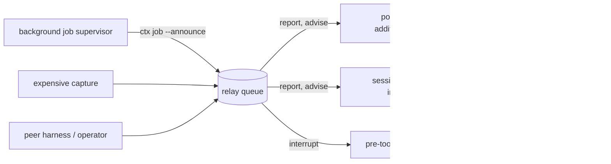

# ADR 008: A cross-harness relay, bounded by the hook boundary

Status: implemented.

## Problem

Every ctx→harness data flow is a return value on a call the harness made. A
hook subprocess answers the hook, an MCP tool call answers the tool call,
`ctx get` answers the command. Nothing in the system can initiate.

The task ledger (ADR-adjacent, `docs/TASK-LEDGER.md`) made harnesses share a
*record* and states the design plainly: harnesses never address each other,
they append and read. That is what makes it durable and what makes it safe.
It is also why nobody is ever *told*.

Three costs, all observed rather than hypothesised:

1. `ctx run --bg` returns a job handle. When the job ends, nothing says so; the
   agent must remember to poll `ctx job`. An agent that forgets never learns
   the build broke, and the supervisor that already knows has no way to say it.
2. Two harnesses on one workspace — the ordinary shape once `ctx orchestrate`
   is in play — cannot exchange a finding. The artifact store is already shared
   and content-addressed, so the *evidence* crosses the boundary fine; the
   knowledge that it exists does not.
3. Nothing can stop a harness heading somewhere a peer has already ruled out.

The tempting fix is a daemon with a live event stream. `docs/ACP.md` already
considered and declined that, and the reasons still hold.

## Decision

Add a **relay**: a workspace-scoped, append-only queue of typed rows, drained
at the hook boundaries that already exist. Three schemas, stored beside the
task ledger under the workspace's own bookkeeping directory, written under the
same `flock` critical section with the same torn-line repair.

```
ctx.watch/v1      a subscription: who wants to hear about what
ctx.signal/v1     a queued delivery: an address, a bounded note, a deadline
ctx.delivery/v1   the receipt: which signal reached whom, at which stage, when
```

No new process, no daemon, no socket. The delivery points are stages the host
already invokes:



The bound is the decision, not a limitation of the implementation. Delivery
latency is **one hook boundary**. An interrupt lands at a **tool-call
boundary**, never mid-stream, because a PreToolUse hook cannot observe
assistant tokens — `ctx.stream_rules` says so and this must not contradict it.
A host that owns its stream can drain the same queue earlier without any change
to the queue.

The **subscriber declares the kind**, not the publisher. One job completion is
an advisory `report` to one harness and an `interrupt` to another, decided by
each of them at subscription time. Publishing is therefore cheap and silent: a
producer never has to know who cares, and a workspace where nobody is watching
queues nothing and spawns nothing.

## Invariants

1. A signal carries an **address and a bounded note, never content** —
   validated by the grammar `ctx task send` already enforces. The two buses
   cannot drift into accepting different things.
2. **A drain marks its signals delivered**, so a stage may drain only on a
   flavor that can actually carry the text. Antigravity's PostToolUse has one
   legal output and is never drained; the native hosts have no
   `additionalContext` and receive the advisory on the substitution channel or
   wait. A message consumed and discarded is the failure this channel exists
   to prevent.
3. **A guard `deny` outranks a relay interrupt.** A peer harness is not a
   safety authority; the relay may raise a decision to `force_ask` and may
   never soften a refusal.
4. **A `ctx` call is never blocked by an interrupt.** The interrupt asks the
   agent to resolve an address; denying the call that resolves it would
   deadlock the agent against the message.
5. **Exactly-once is matched on the signal, not on the subscriber string.**
   `claude` and `claude:s1` are two addresses for one reader. A broadcast to
   `*` is the sole exception and keeps a per-subscriber key.
6. **The relay is advisory and may never become a new failure mode.** The
   hook's drain is gated on the queue file existing (one `os.path.exists`, no
   import — the hot path is pinned by test) and every path degrades to silence
   on a corrupt, unreadable or read-only queue.
7. **Every bound is enforced on write and on render**: pending per subscriber,
   signals per drain, rendered characters, note length, ref length, TTL. A
   queue that grows without limit is a context leak with extra steps.

## Consequences

Two producers ship with the mechanism and are the proof it is used rather than
merely available. A backgrounded run announces its `run:` address when a
harness subscribed to the `job` topic before launch — and the supervisor stays
dependency-free, shelling out to a detached `ctx` rather than importing its way
around its own contract. An expensive capture publishes on the `digest` topic,
which is the piece that makes the already-shared store actually shared: the
peer now knows the address exists.

The MCP tool gains `relay_watch`, `relay_publish` and `relay_pending`, so an
agent can use the relay from inside any harness rather than shelling out. That
changes prefix-resident bytes and moves `PREFIX_VERSION` 11 → 12, at the cost
of one cold prefix-cache write per model.

What this does **not** unlock, stated so it is not assumed: a warm peer. ACP
sessions remain single-shot, so a harness can now be told something but still
cannot be handed a follow-up. That is the next structural change, and it
composes with this one rather than replacing it —
`docs/HARNESS-COLLABORATION.md` carries the ranked backlog.

See [the relay](../../docs/RELAY.md) for the command surface, the per-host
delivery table, and the bounds.
